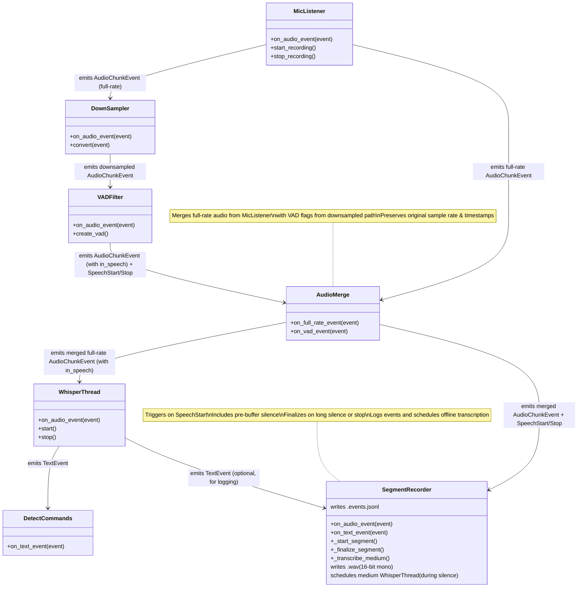

```mermaid
classDiagram
    direction TB

    class MicListener {
        +on_audio_event(event)
        +start_recording()
        +stop_recording()
    }
    class DownSampler {
        +on_audio_event(event)
        +convert(event)
    }
    class VADFilter {
        +on_audio_event(event)
        +create_vad()
    }
    class AudioMerge {
        +on_full_rate_event(event)
        +on_vad_event(event)
    }
    class WhisperThread {
        +on_audio_event(event)
        +start()
        +stop()
    }
    class SegmentRecorder {
        +on_audio_event(event)
        +on_text_event(event)
        +_start_segment()
        +_finalize_segment()
        +_transcribe_medium()
    }
    class DetectCommands {
        +on_text_event(event)
    }

    MicListener --> DownSampler : emits AudioChunkEvent (full-rate)
    DownSampler --> VADFilter : emits downsampled AudioChunkEvent
    MicListener --> AudioMerge : emits full-rate AudioChunkEvent
    VADFilter --> AudioMerge : emits AudioChunkEvent (with in_speech) + SpeechStart/Stop
    AudioMerge --> WhisperThread : emits merged full-rate AudioChunkEvent (with in_speech)
    AudioMerge --> SegmentRecorder : emits merged AudioChunkEvent + SpeechStart/Stop
    WhisperThread --> DetectCommands : emits TextEvent
    WhisperThread --> SegmentRecorder : emits TextEvent (optional, for logging)
    SegmentRecorder : writes .wav (16-bit mono)
    SegmentRecorder : writes .events.jsonl
    SegmentRecorder : schedules medium WhisperThread (during silence)

    note for AudioMerge "Merges full-rate audio from MicListener\nwith VAD flags from downsampled path\nPreserves original sample rate & timestamps"
    note for SegmentRecorder "Triggers on SpeechStart\nIncludes pre-buffer silence\nFinalizes on long silence or stop\nLogs events and schedules offline transcription"
```
