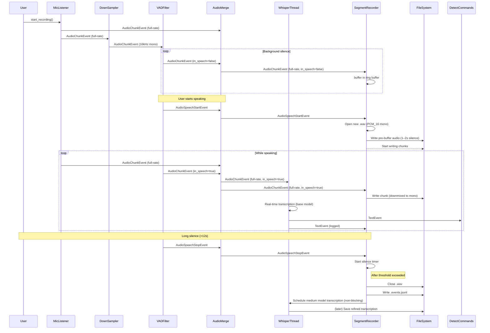

```mermaid
sequenceDiagram
    participant User
    participant MicListener
    participant DownSampler
    participant VADFilter
    participant AudioMerge
    participant WhisperThread
    participant SegmentRecorder
    participant FileSystem

    User->>MicListener: start_recording()
    MicListener->>AudioMerge: AudioChunkEvent (full-rate)
    MicListener->>DownSampler: AudioChunkEvent (full-rate)
    DownSampler->>VADFilter: AudioChunkEvent (16kHz mono)

    loop Background silence
        VADFilter->>AudioMerge: AudioChunkEvent (in_speech=false)
        AudioMerge->>SegmentRecorder: AudioChunkEvent (full-rate, in_speech=false)
        SegmentRecorder->>SegmentRecorder: buffer in ring buffer
    end

    Note over VADFilter,AudioMerge: User starts speaking

    VADFilter->>AudioMerge: AudioSpeechStartEvent
    AudioMerge->>SegmentRecorder: AudioSpeechStartEvent
    SegmentRecorder->>SegmentRecorder: Open new .wav (PCM_16 mono)
    SegmentRecorder->>FileSystem: Write pre-buffer audio (1–2s silence)
    SegmentRecorder-->>FileSystem: Start writing chunks

    loop While speaking
        MicListener->>AudioMerge: AudioChunkEvent (full-rate)
        VADFilter->>AudioMerge: AudioChunkEvent (in_speech=true)
        AudioMerge->>WhisperThread: AudioChunkEvent (full-rate, in_speech=true)
        AudioMerge->>SegmentRecorder: AudioChunkEvent (full-rate, in_speech=true)
        SegmentRecorder->>FileSystem: Write chunk (downmixed to mono)
        WhisperThread->>WhisperThread: Real-time transcription (base model)
        WhisperThread->>DetectCommands: TextEvent
        WhisperThread->>SegmentRecorder: TextEvent (logged)
    end

    Note over User,SegmentRecorder: Long silence (>12s)

    VADFilter->>AudioMerge: AudioSpeechStopEvent
    AudioMerge->>SegmentRecorder: AudioSpeechStopEvent
    SegmentRecorder->>SegmentRecorder: Start silence timer

    Note right of SegmentRecorder: After threshold exceeded
    SegmentRecorder->>FileSystem: Close .wav
    SegmentRecorder->>FileSystem: Write .events.jsonl
    SegmentRecorder->>WhisperThread: Schedule medium model transcription (non-blocking)
    WhisperThread->>FileSystem: (later) Save refined transcription
```
