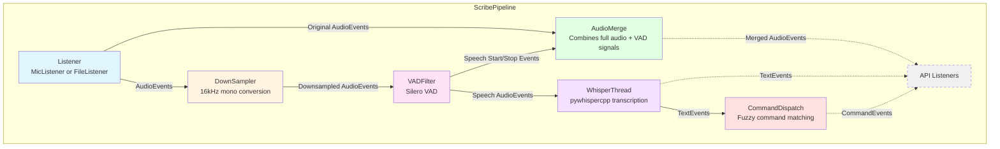
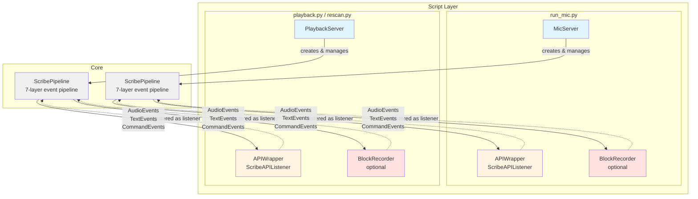
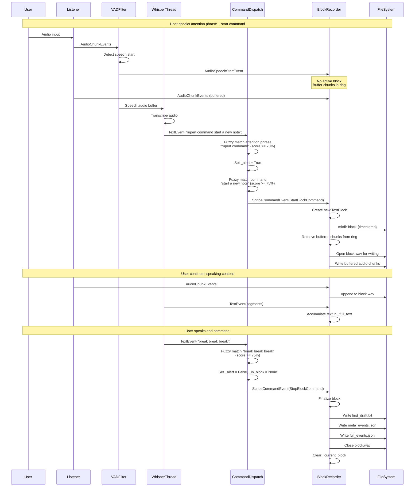

# Palaver Architecture Diagrams

This document provides visual representations of the Palaver voice transcription system architecture, focusing on the ScribePipeline component structure and event flow.

## Overview

Palaver uses an event-driven pipeline architecture where audio flows through a chain of processors, each emitting events for downstream consumers. The system supports multiple audio sources (microphone, file playback) and can optionally record structured blocks of transcribed text triggered by voice commands.

---

## 1. Pipeline Component Architecture

This diagram shows the internal structure of `ScribePipeline` and how its seven layers are connected through event streams.

### Component Responsibilities

**Listener (MicListener / FileListener)**
- Source of audio data
- Emits `AudioStartEvent`, `AudioChunkEvent`, `AudioStopEvent`
- MicListener captures from system microphone using sounddevice
- FileListener reads from WAV files using soundfile

**DownSampler**
- Converts audio to target format (default: 16kHz mono)
- Required for VAD and Whisper processing
- Uses resampy for sample rate conversion

**VADFilter**
- Voice Activity Detection using Silero VAD
- Emits `AudioSpeechStartEvent` and `AudioSpeechStopEvent`
- Marks `AudioChunkEvent.in_speech` flag
- Configurable silence threshold and speech padding

**AudioMerge**
- Merges two event streams: full audio from listener + VAD signals
- Provides downstream listeners with original quality audio plus VAD timing
- Uses two "shims" to receive events from different sources

**WhisperThread**
- Speech-to-text transcription using pywhispercpp
- Runs in separate thread or process
- Buffers audio until speech stops or buffer fills
- Emits `TextEvent` with VTT-formatted segments

**CommandDispatch**
- Analyzes transcribed text for command phrases
- Uses rapidfuzz for fuzzy string matching
- Two-stage matching: attention phrases (70% threshold) then commands (75% threshold)
- Emits `ScribeCommandEvent` with `StartBlockCommand` or `StopBlockCommand`

**API Listeners**
- Consumer interface for pipeline events
- Receive audio, text, and command events
- Examples: BlockRecorder, APIWrapper, StreamMonitor

---

## 2. Script Wrapper Architecture

This diagram shows how the command-line tools (`run_mic.py`, `playback.py`, `rescan.py`) wrap the pipeline and attach optional components like BlockRecorder.

### Server Components

**MicServer** (`src/palaver/scribe/mic_server.py`)
- Wraps ScribePipeline with MicListener
- Manages lifecycle: setup → run → shutdown
- Uses async context managers for proper cleanup

**PlaybackServer** (`src/palaver/scribe/playback_server.py`)
- Wraps ScribePipeline with FileListener
- Can simulate real-time playback or run at full speed
- Used by both `playback.py` and `rescan.py`
- Rescan mode uses larger audio buffers (10s vs 2s) and better models

**APIWrapper** (defined in scripts)
- Implements ScribeAPIListener protocol
- Tracks blocks and accumulated text
- Prints transcription results to console
- Coordinates with BlockRecorder when enabled

**BlockRecorder** (`src/palaver/scribe/recorders/block_audio.py`)
- Optional component enabled with `--output-dir` flag
- Captures voice-commanded text blocks
- Maintains ring buffer for pre-command audio capture
- Writes structured output to disk

### Wiring Pattern

All scripts follow this pattern:
1. Create a Server (MicServer or PlaybackServer)
2. Server creates PipelineConfig and Listener
3. Server instantiates ScribePipeline in async context
4. Script creates APIWrapper and optional BlockRecorder
5. On `pipeline.on_pipeline_ready()`: BlockRecorder is registered
6. Pipeline distributes events to all registered listeners

---

## 3. Event Flow - Text Block Creation

This sequence diagram shows the complete lifecycle of creating a voice-commanded text block, from attention phrase detection through file output.

### Key Behaviors

**Pre-Command Audio Buffering**
- BlockRecorder maintains a ring buffer (default: 3 seconds)
- When speech starts but no block is active, chunks are buffered
- On StartBlockCommand, buffered audio is written to the block
- This captures the attention phrase and command in the recording

**Fuzzy Matching Thresholds**
- Attention phrases: 70% similarity (more lenient)
- Commands: 75% similarity (more strict)
- Uses rapidfuzz's Levenshtein distance with partial ratio alignment
- Allows natural speech variations while avoiding false positives

**Command State Machine**
- `_alert`: Whether attention phrase has been detected
- `_in_block`: Current active block (prevents nested blocks)
- `_require_alerts`: Whether commands need attention phrase (configurable)

**Block Output Structure**
Each block creates a timestamped directory containing:
- `block.wav` - Audio recording (PCM_16 format with 0.4s leading/trailing silence)
- `first_draft.txt` - Accumulated transcribed text
- `meta_events.json` - Audio events, text events, command events (without audio data)
- `full_events.json` - Complete event stream (audio data marked as "omitted")
- `rescan_directory/` - Created by rescan.py with improved transcription

**Rescan Workflow**
The `rescan.py` tool:
1. Reads an existing `block.wav` file
2. Reprocesses with larger model and longer audio windows
3. Writes `rescan_draft.txt` and `rescan_meta_events.json`
4. Provides higher quality transcription without re-recording

---

## Event Types Reference

**AudioEvent** (`src/palaver/scribe/audio_events.py`)
- `AudioStartEvent` - Stream initialization with format parameters
- `AudioChunkEvent` - Raw audio data (numpy arrays)
- `AudioSpeechStartEvent` - VAD detected speech beginning
- `AudioSpeechStopEvent` - VAD detected speech end
- `AudioStopEvent` - Stream termination
- `AudioErrorEvent` - Error conditions

**TextEvent** (`src/palaver/scribe/text_events.py`)
- Contains transcribed text segments in VTT format
- Includes timing information (audio start/end timestamps)
- May contain multiple segments per event

**ScribeCommandEvent** (`src/palaver/scribe/command_events.py`)
- Contains matched command object (StartBlockCommand, StopBlockCommand)
- References the TextEvent that triggered the match
- Includes pattern matched and alignment information

---

## Notes

- All components communicate via async event emission (eventemitter library)
- Pipeline uses async context managers for guaranteed cleanup
- Error handling propagates through `error_callback` mechanism
- Scripts use `TopErrorHandler` to coordinate shutdown across components
- The architecture supports adding custom API listeners without modifying core code
