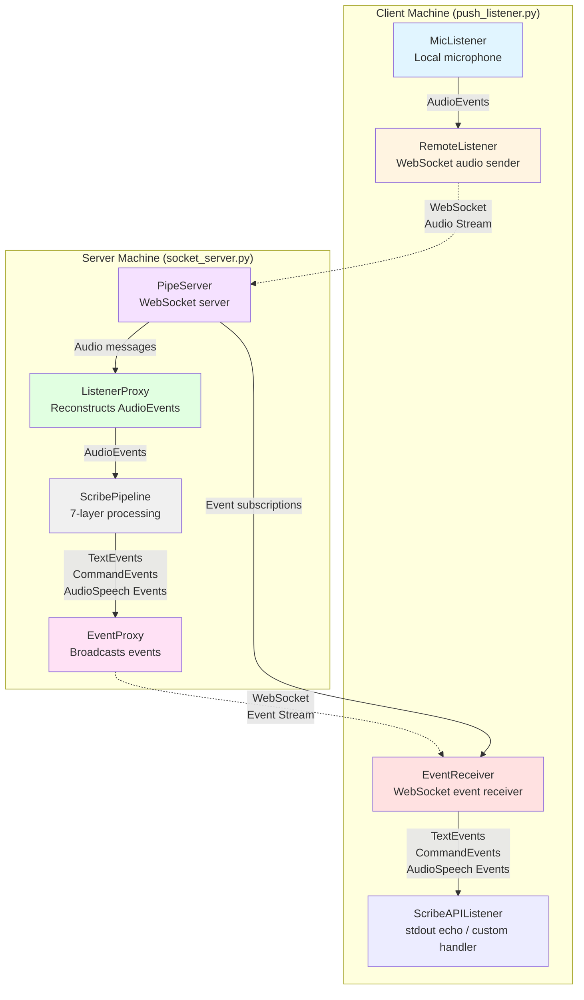
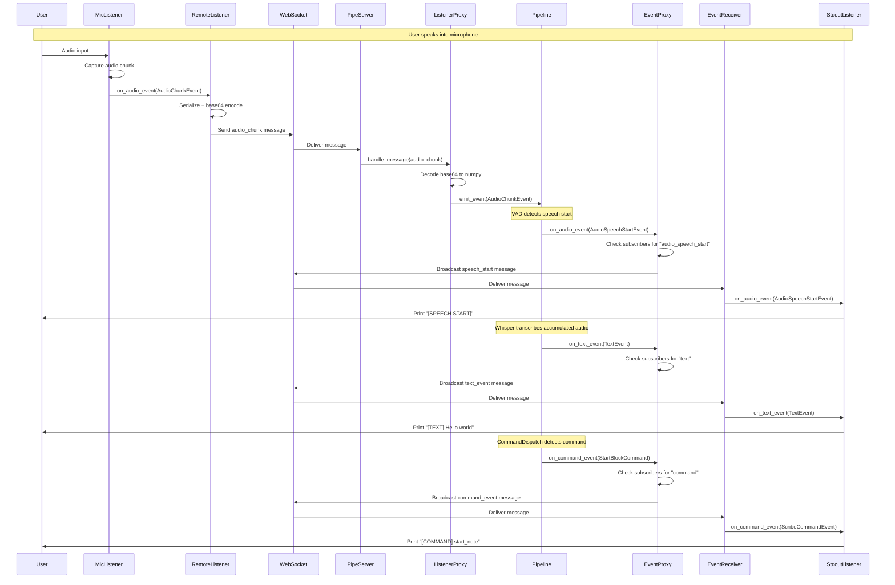

# Palaver WebSocket Architecture

This document describes the distributed processing architecture for Palaver, enabling audio capture and pipeline processing to occur on separate machines connected via WebSockets.

## Overview

The WebSocket architecture splits the Palaver pipeline into two parts:
1. **Audio Source** - Captures audio and sends it over WebSocket (push_listener.py client)
2. **Processing Server** - Receives audio, runs pipeline, and streams results back (socket_server.py)

This enables use cases such as:
- Running transcription on a GPU-equipped server while capturing audio on a laptop
- Multiple audio sources feeding into a single processing pipeline
- Remote monitoring of transcription and command events
- Distributed testing and development

---

## Architecture Diagram



---

## Component Details

### Server Components

#### PipeServer (`src/palaver/websockets/pipe_server.py`)

**Purpose**: WebSocket server that bridges remote audio sources with the local pipeline

**Responsibilities**:
- Accept WebSocket connections from RemoteListener clients (audio input)
- Accept WebSocket connections from EventReceiver clients (event output)
- Manage connection lifecycle and error handling
- Route audio messages to ListenerProxy
- Route pipeline events to EventProxy
- Handle client subscription requests

**Class Structure**:
```python
class PipeServer:
    """WebSocket server for distributed audio processing"""

    def __init__(self, host: str, port: int,
                 audio_listener: "ListenerProxy",
                 event_proxy: "EventProxy"):
        """
        Args:
            host: Server bind address
            port: Server port
            audio_listener: Proxy that emits AudioEvents to pipeline
            event_proxy: Proxy that broadcasts events to subscribers
        """

    async def start(self) -> None:
        """Start WebSocket server"""

    async def stop(self) -> None:
        """Stop server and close all connections"""

    async def _handle_audio_connection(self, websocket, path) -> None:
        """Handle incoming audio stream from RemoteListener"""

    async def _handle_event_connection(self, websocket, path) -> None:
        """Handle event subscription from EventReceiver"""

    async def __aenter__(self) -> "PipeServer":
        """Async context manager support"""

    async def __aexit__(self, exc_type, exc, tb) -> None:
        """Cleanup on exit"""
```

**WebSocket Endpoints**:
- `/audio` - Audio input endpoint (receives AudioEvents)
- `/events` - Event output endpoint (sends TextEvents, CommandEvents, etc.)

**Message Protocol**:
All messages are JSON-encoded with a `type` field indicating the message type.

Audio input messages:
```json
{
  "type": "audio_start",
  "source_id": "ase://...",
  "stream_start_time": 1234567890.123,
  "sample_rate": 44100,
  "channels": 1,
  "blocksize": 1323,
  "datatype": "float32"
}

{
  "type": "audio_chunk",
  "source_id": "ase://...",
  "stream_start_time": 1234567890.123,
  "data": [base64-encoded numpy array],
  "dtype": "float32",
  "shape": [1323, 1],
  "duration": 0.03,
  "in_speech": false,
  "sample_rate": 44100,
  "channels": 1,
  "blocksize": 1323,
  "datatype": "float32",
  "meta_data": {}
}

{
  "type": "audio_stop",
  "source_id": "ase://...",
  "stream_start_time": 1234567890.123
}
```

Event output messages (subscription management):
```json
{
  "type": "subscribe",
  "event_types": ["text", "command", "audio_speech_start", "audio_speech_stop"]
}

{
  "type": "unsubscribe",
  "event_types": ["text"]
}
```

Event broadcast messages:
```json
{
  "type": "text_event",
  "event": {
    "text": "Hello world",
    "segments": [...],
    "audio_start_time": 1234567890.123,
    "audio_end_time": 1234567890.456
  }
}

{
  "type": "command_event",
  "event": {
    "command": "start_note",
    "pattern": "start a new note",
    "text_event": {...}
  }
}

{
  "type": "audio_speech_start",
  "event": {
    "source_id": "ase://...",
    "stream_start_time": 1234567890.123
  }
}

{
  "type": "audio_speech_stop",
  "event": {
    "source_id": "ase://...",
    "stream_start_time": 1234567890.123
  }
}
```

#### ListenerProxy (`src/palaver/websockets/pipe_server.py`)

**Purpose**: Reconstructs AudioEvents from WebSocket messages and emits them to the pipeline

**Responsibilities**:
- Convert JSON messages to AudioEvent objects
- Decode base64-encoded audio data into numpy arrays
- Implement Listener interface (emit events via eventemitter)
- Validate message format and handle errors

**Class Structure**:
```python
class ListenerProxy(ListenerCCSMixin, Listener):
    """Receives audio via WebSocket and emits AudioEvents"""

    def __init__(self):
        super().__init__(chunk_duration=0.03)
        self._source_id = None
        self._stream_start_time = None

    async def handle_message(self, message: dict) -> None:
        """Process incoming WebSocket message and emit corresponding event"""

    async def start_streaming(self) -> None:
        """Mark as ready to receive audio"""

    async def stop_streaming(self) -> None:
        """Clean shutdown"""
```

**Event Emission**:
Inherits from `ListenerCCSMixin` to provide `emit_event()` method and standard error handling.

#### EventProxy (`src/palaver/websockets/pipe_server.py`)

**Purpose**: Receives events from pipeline components and broadcasts them to subscribed WebSocket clients

**Responsibilities**:
- Implement AudioEventListener, TextEventListener, CommandEventListener protocols
- Track subscriber connections and their subscriptions
- Serialize events to JSON (excluding AudioChunkEvents)
- Broadcast to relevant subscribers based on event type
- Handle connection failures gracefully

**Class Structure**:
```python
class EventProxy:
    """Broadcasts pipeline events to WebSocket subscribers"""

    def __init__(self):
        self._subscribers: dict[websocket, set[str]] = {}
        self._lock = asyncio.Lock()

    async def add_subscriber(self, websocket, event_types: list[str]) -> None:
        """Register a new subscriber for specific event types"""

    async def remove_subscriber(self, websocket) -> None:
        """Remove subscriber on disconnect"""

    async def on_audio_event(self, event: AudioEvent) -> None:
        """Handle AudioEvents (start, stop, speech markers only)"""

    async def on_text_event(self, event: TextEvent) -> None:
        """Handle TextEvents"""

    async def on_command_event(self, event: ScribeCommandEvent) -> None:
        """Handle CommandEvents"""

    async def _broadcast(self, message: dict, event_type: str) -> None:
        """Send message to all subscribers interested in event_type"""
```

**Subscription Model**:
- Clients send `subscribe` message with list of event types
- Event types: `"text"`, `"command"`, `"audio_speech_start"`, `"audio_speech_stop"`, `"audio_start"`, `"audio_stop"`
- Clients can subscribe to multiple types
- `AudioChunkEvent` is never broadcast (too much data)

---

### Client Components

#### RemoteListener (`src/palaver/websockets/remote_listener.py`)

**Purpose**: Wraps a local Listener (like MicListener) and forwards its events over WebSocket

**Responsibilities**:
- Connect to one or more PipeServer instances
- Implement AudioEventListener protocol
- Serialize AudioEvents to JSON
- Encode numpy audio data as base64
- Handle connection failures and reconnection
- Support connection pooling for redundancy

**Class Structure**:
```python
class RemoteListener:
    """Sends audio events to remote PipeServer over WebSocket"""

    def __init__(self, server_urls: list[str], local_listener: Listener):
        """
        Args:
            server_urls: List of ws://host:port/audio endpoints
            local_listener: Local audio source (e.g., MicListener)
        """
        self._server_urls = server_urls
        self._local_listener = local_listener
        self._connections: list[websocket] = []
        self._running = False

    async def connect(self) -> None:
        """Establish WebSocket connections to all servers"""

    async def disconnect(self) -> None:
        """Close all connections"""

    async def on_audio_event(self, event: AudioEvent) -> None:
        """Receive event from local listener and forward to servers"""

    async def _send_to_all(self, message: dict) -> None:
        """Broadcast message to all connected servers"""

    async def start(self) -> None:
        """Start local listener and begin forwarding"""

    async def stop(self) -> None:
        """Stop listener and disconnect"""

    async def __aenter__(self) -> "RemoteListener":
        """Async context manager support"""

    async def __aexit__(self, exc_type, exc, tb) -> None:
        """Cleanup on exit"""
```

**Audio Data Encoding**:
AudioChunkEvent data (numpy arrays) are serialized as:
```python
{
    "data": base64.b64encode(array.tobytes()).decode('ascii'),
    "dtype": str(array.dtype),
    "shape": list(array.shape)
}
```

Reconstruction on server:
```python
data_bytes = base64.b64decode(message['data'])
array = np.frombuffer(data_bytes, dtype=message['dtype'])
array = array.reshape(message['shape'])
```

#### EventReceiver (`src/palaver/websockets/event_receiver.py`)

**Purpose**: Receives events from PipeServer and distributes them to local ScribeAPIListener implementations

**Responsibilities**:
- Connect to PipeServer event endpoint
- Send subscription request
- Deserialize incoming event messages
- Reconstruct event objects from JSON
- Distribute to registered listeners
- Handle connection failures

**Class Structure**:
```python
class EventReceiver:
    """Receives events from remote PipeServer and distributes locally"""

    def __init__(self, server_url: str, event_types: list[str] = None):
        """
        Args:
            server_url: ws://host:port/events endpoint
            event_types: Events to subscribe to (default: all except audio_chunk)
        """
        self._server_url = server_url
        self._event_types = event_types or [
            "text", "command", "audio_speech_start", "audio_speech_stop",
            "audio_start", "audio_stop"
        ]
        self._listeners: list[ScribeAPIListener] = []
        self._connection = None
        self._running = False
        self._receiver_task = None

    async def connect(self) -> None:
        """Connect to server and send subscription"""

    async def disconnect(self) -> None:
        """Close connection"""

    def add_listener(self, listener: ScribeAPIListener) -> None:
        """Register a listener for event distribution"""

    async def _receive_loop(self) -> None:
        """Main loop receiving and distributing events"""

    async def _handle_event(self, message: dict) -> None:
        """Deserialize and distribute a single event"""

    async def start(self) -> None:
        """Start receiving events"""

    async def stop(self) -> None:
        """Stop receiver loop and disconnect"""

    async def __aenter__(self) -> "EventReceiver":
        """Async context manager support"""

    async def __aexit__(self, exc_type, exc, tb) -> None:
        """Cleanup on exit"""
```

**Event Distribution**:
EventReceiver calls appropriate methods on registered listeners:
- TextEvent → `listener.on_text_event(event)`
- ScribeCommandEvent → `listener.on_command_event(event)` (if supported)
- AudioSpeechStartEvent → `listener.on_audio_event(event)` (if supported)

---

## Script Implementations

### socket_server.py

**Purpose**: Runs the processing server that receives audio and runs the full pipeline

**Command-line Interface**:
```bash
uv run scripts/socket_server.py --host 0.0.0.0 --port 8765 [--output-dir DIR]
```

**Arguments**:
- `--host`: Server bind address (default: localhost)
- `--port`: Server port (default: 8765)
- `--output-dir`: Optional directory for BlockRecorder output

**Implementation Outline**:
```python
async def main(host: str, port: int, output_dir: Optional[Path]):
    # Create pipeline components
    listener_proxy = ListenerProxy()
    event_proxy = EventProxy()

    # Create WebSocket server
    server = PipeServer(host, port, listener_proxy, event_proxy)

    # Create pipeline (similar to run_mic.py)
    async with listener_proxy:
        downsampler = DownSampler(target_samplerate=16000, target_channels=1)
        listener_proxy.add_event_listener(downsampler)

        vad_filter = VADFilter(listener_proxy)
        downsampler.add_event_listener(vad_filter)

        # AudioMerge to combine full audio + VAD signals
        audio_merge = AudioMerge(listener_proxy, vad_filter)

        # WhisperThread
        whisper = WhisperThread(model_path, error_callback)
        vad_filter.add_event_listener(whisper)

        # CommandDispatch
        command_dispatch = CommandDispatch()
        whisper.add_event_listener(command_dispatch)

        # Register event_proxy as listener to all components
        audio_merge.add_event_listener(event_proxy)
        whisper.add_event_listener(event_proxy)
        command_dispatch.add_event_listener(event_proxy)

        # Optional BlockRecorder
        if output_dir:
            block_recorder = BlockRecorder(output_dir)
            audio_merge.add_event_listener(block_recorder)
            whisper.add_event_listener(block_recorder)
            command_dispatch.add_event_listener(block_recorder)

        # Start server
        async with server:
            await server.start()
            print(f"Server listening on {host}:{port}")

            try:
                while True:
                    await asyncio.sleep(1)
            except KeyboardInterrupt:
                print("Shutting down...")
            finally:
                await whisper.gracefull_shutdown(3.0)
                await server.stop()
```

**Logging**:
- Connection/disconnection events
- Audio stream start/stop
- Event broadcast statistics
- Error conditions

### push_listener.py

**Purpose**: Client that captures local audio and sends it to server, printing events received

**Command-line Interface**:
```bash
uv run scripts/push_listener.py --server ws://localhost:8765
```

**Arguments**:
- `--server`: WebSocket server URL (default: ws://localhost:8765)
- `--subscribe`: Event types to subscribe to (default: all)

**Implementation Outline**:
```python
class StdoutListener:
    """Simple ScribeAPIListener that echoes events to stdout"""

    async def on_text_event(self, event: TextEvent) -> None:
        print(f"[TEXT] {event.text}")

    async def on_command_event(self, event: ScribeCommandEvent) -> None:
        print(f"[COMMAND] {event.command}")

    async def on_audio_event(self, event: AudioEvent) -> None:
        if isinstance(event, AudioSpeechStartEvent):
            print("[SPEECH START]")
        elif isinstance(event, AudioSpeechStopEvent):
            print("[SPEECH STOP]")

async def main(server_url: str, event_types: list[str]):
    # Create local microphone listener
    mic = MicListener()

    # Create remote listener to forward audio
    remote = RemoteListener([server_url + "/audio"], mic)
    mic.add_event_listener(remote)

    # Create event receiver
    receiver = EventReceiver(server_url + "/events", event_types)

    # Add stdout listener
    stdout_listener = StdoutListener()
    receiver.add_listener(stdout_listener)

    # Run both
    async with mic, remote, receiver:
        await mic.start_streaming()
        await remote.connect()
        await receiver.connect()
        await receiver.start()

        print(f"Connected to {server_url}")
        print("Speak into microphone... (Ctrl+C to quit)")

        try:
            while True:
                await asyncio.sleep(0.1)
        except KeyboardInterrupt:
            print("\nShutting down...")
        finally:
            await receiver.stop()
            await remote.disconnect()
            await mic.stop()
```

---

## Event Flow Sequence

### Full Distributed Transcription Flow



---

## Error Handling and Resilience

### Connection Failures

**Server-side**:
- PipeServer continues running if a client disconnects
- EventProxy removes disconnected clients from subscriber list
- ListenerProxy can handle multiple simultaneous audio sources (future enhancement)

**Client-side**:
- RemoteListener can be configured with multiple server URLs for redundancy
- EventReceiver should implement reconnection logic with exponential backoff
- Audio buffering during disconnection (optional future enhancement)

### Message Validation

All components should validate incoming messages:
- Required fields present
- Data types correct
- Audio data can be decoded
- Event reconstruction succeeds

Invalid messages should be logged but not crash the component.

### Background Task Errors

Follow the existing error handling pattern from `ListenerCCSMixin`:
```python
async def _background_task(self):
    try:
        # Main work
        pass
    except asyncio.CancelledError:
        logger.info("Task cancelled")
        raise
    except Exception as e:
        logger.error(f"Error in background task: {e}")
        logger.error(traceback.format_exc())
        # Optionally call error callback
    finally:
        await self._cleanup()
```

---

## Implementation Notes

### WebSocket Library

Use `websockets` library (already in dependencies or add to pyproject.toml):
```python
import websockets
```

Server:
```python
async with websockets.serve(handler, host, port):
    await asyncio.Future()  # run forever
```

Client:
```python
async with websockets.connect(uri) as websocket:
    await websocket.send(json.dumps(message))
    response = await websocket.recv()
```

### JSON Serialization

Create helper functions for event serialization:
```python
def serialize_audio_event(event: AudioEvent) -> dict:
    """Convert AudioEvent to JSON-serializable dict"""

def deserialize_audio_event(data: dict) -> AudioEvent:
    """Reconstruct AudioEvent from dict"""

def serialize_text_event(event: TextEvent) -> dict:
    """Convert TextEvent to JSON-serializable dict"""

def deserialize_text_event(data: dict) -> TextEvent:
    """Reconstruct TextEvent from dict"""
```

Place these in `src/palaver/websockets/serialization.py`.

### Testing Strategy

**Unit Tests**:
- Test serialization/deserialization roundtrips
- Test message validation
- Test subscription management

**Integration Tests**:
- Start socket_server.py and push_listener.py in test
- Send test audio file through pipeline
- Verify events received correctly
- Test reconnection behavior

**Manual Testing**:
1. Start socket_server.py on one terminal
2. Start push_listener.py on another terminal
3. Speak into microphone and verify output

### Future Enhancements

**Phase 2 - Enhanced Reliability**:
- Audio buffering during network interruptions
- Automatic reconnection with exponential backoff
- Message acknowledgments and retransmission
- Connection pooling and load balancing

**Phase 3 - Multiple Clients**:
- Support multiple simultaneous audio sources
- Audio source identification and routing
- Per-source pipeline instances or multiplexing

**Phase 4 - Bidirectional Control**:
- Client can send control messages (start/stop recording, change models)
- Server can request specific event types
- Dynamic pipeline reconfiguration

**Phase 5 - Security**:
- TLS/WSS support
- Authentication and authorization
- Rate limiting and DoS protection

---

## File Structure

```
src/palaver/websockets/
├── __init__.py
├── pipe_server.py        # PipeServer, ListenerProxy, EventProxy
├── remote_listener.py    # RemoteListener
├── event_receiver.py     # EventReceiver
└── serialization.py      # Event serialization helpers

scripts/
├── socket_server.py      # Server script
└── push_listener.py      # Client script

tests/
└── websockets/
    ├── test_serialization.py
    ├── test_pipe_server.py
    ├── test_remote_listener.py
    └── test_integration.py
```

---

## Open Questions

1. **Audio Latency**: How much latency is acceptable? Should we prioritize low-latency streaming or larger chunks for efficiency?

2. **Event Ordering**: Do we need to guarantee event ordering across the WebSocket connection, or is eventual consistency acceptable?

3. **Backpressure**: What happens if EventReceiver clients can't keep up with the event stream? Should we buffer, drop, or block?

4. **Source Identification**: When supporting multiple audio sources, how should we identify and route them? Include source_id in all messages?

5. **Protocol Versioning**: Should messages include a protocol version field for future compatibility?

6. **Compression**: Should we compress audio data beyond base64 encoding (e.g., gzip, opus)?

Please review these design decisions and let me know if you'd like any changes before implementation begins.
